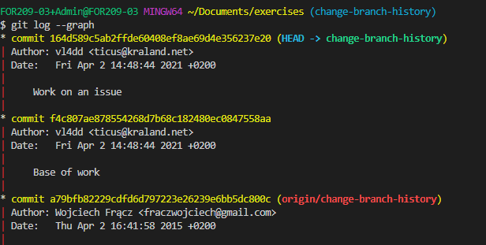

# Git

## Description

Git is a free and open source distributed version control system designed to handle everything from small to very large projects with speed and efficiency. 

## Useful links

- a very handy [cheat sheet](https://gitea.86thumbs.net/waldek/LinuxSysAdminsDoc/raw/branch/master/Git/SWTM-2088_Atlassian-Git-Cheatsheet.pdf) in pdf outlines the basic Git commands to help you learn git, as well as more advanced concepts such as Git branches, remote repositories, undoing changes, and much much more
- the main git [documentation](https://git-scm.com/book/en/v2) is an excellent reference manual

## Git System

The diagram below outlines the main gt commands and how they relate to the version control system.
In our classes the **local** is the repository on your own computer and the **remote** is the corresponding repository you create on our [gitea](https://gitea.86thumbs.net/) server.
Nothing is stopping you from hosting your own gitea server or pushing your local repository to a third party server such as [gitlab](https://about.gitlab.com/).


A remote repository is often referenced by the name **origin** but this naming is fully up to you.
If you would push to multiple remote locations you could for example add one named gitea for our own and gitlab for your gitlab account.

```bash
git remote add gitea https://gitea.86thumbs.net/USER/REPOSITORY.git
git remote add gitlab https://gitlab.com/USER/REPOSITORY.git
```

# Basic commands

## Git clone

Clone repo located at **\<repo>** onto local machine. Original repo can be located on the local file system or on a remote machine via **HTTPS** or **SSH**.
Throughout the classes you'll first clone via HTTPS but once we'll learn about [RSA](https://en.wikipedia.org/wiki/RSA_(cryptosystem)) you'll be able to clone, push and pull over SSH.

```bash
git clone $REPOSITORY_URL

```

## Git config --global name & email 

Before you can use git you **need** to identity yourself.
Git uses this information in each commit so we can keep track of **who** did **what** **when**.

```bash
git config --global user.name "$FISTNAME $LASTNAME"
git config --global user.email "$EMAIL"
```

## Git init

To initialize an existing directory as a Git repository you have to input the following command into a shell.
On windows your best bet is to launch a **git bash** shell by right clicking in the folder.
On linux you can just open a terminal, navigate to the desired directory and execute the command.

```bash
git init
```

If you want to create a new directory with git version control inside it you run the following command.

```bash
git init $DIR_NAME
```

## Git status

List which files are staged, unstaged, and untracked.
This gives you a good overview of the current state of you repository and hints towards which files you can or should stage.

```bash
git status
```

## Git add 

By staging files you put them in the list to be added to the next commit.
You can add one or more files at the same time.
Complete directories can also be added.

```bash
git add readme.md image.jpg
```

## Git commit 

You commit your staged content as a new commit snapshot with the following command.
The message you include in the commit is fully up to you but as a general rule of thumb it should explain what the commit does.
For example: this commit *"adds pictures to the asset folder"*
Some projects have serious commit message [guidelines](https://www.datree.io/resources/git-commit-message), others not.

```bash
git commit -m "$YOUR_COMMIT_MESSAGE"
```

If the identity is not correct you can fix this this the following command.

```bash
git commit --amend --reset-author
```

## Git diff

Show unstaged changes between your index and working directory.

> $ git diff

## Git log
Show all commits in the current branch’s history

> $ git log
 
### Graphs

The --graph option draws an ASCII graph representing the branch structure of the commit history. This is commonly used in conjunction with the --oneline and --decorate commands to make it easier to see which commit belongs to which branch:

> $ git log --graph --oneline --decorate



## Tig
Tig allows you to browse changes in a Git repository and can additionally act as a pager for output of various Git commands. When used as a pager, it will display input from stdin and colorize it.

> $ tig

When browsing repositories, Tig uses the underlying Git commands to present the user with various views, such as summarized commit log and showing the commit with the log message, diffstat, and the diff.


#
# SHARE & UPDATE
#
### Retrieving updates from another repository and updating local repos
=================================

add a git URL as an alias

>git remote add [alias] [url]

fetch down all the branches from that Git remote

>git fetch [alias]

merge a remote branch into your current branch to bring it up to date
>git merge [alias]/[branch]


Transmit local branch commits to the remote repository branch

>git push [alias] [branch]

>git pull

fetch and merge any commits from the tracking remote branch

## BRANCH & MERGE
### Isolating work in branches, changing context, and integrating changes


>git branch

list your branches. a * will appear next to the currently active branch

>git branch [branch-name]

create a new branch at the current commit

>git checkout

switch to another branch and check it out into your working directory

>git checkout -b|-B <new_branch> [<start point>]

Specifying -b causes a new branch to be created as if git-branch(1) were called and then checked out. 

If -B is given, <new_branch> is created if it doesn’t exist; otherwise, it is reset. This is the transactional equivalent of

>git merge [branch]

merge the specified branch’s history into the current one

>git log

show all commits in the current branch’s history

## TRACKING PATH CHANGES
### Versioning file removes and path changes
=================================

Delete the file from project and stage the removal for commit

>git rm [file]

Change an existing file path and stage the move

>git mv [existing-path] [new-path]

Show all commit logs with indication of any paths that moved

>git log --stat -M


### Checker le satus
> git status

Ajouter un element dans la branche
> git add Readme.md

Commit les changement
> git commit -m "First commit"

Show all commit
>git checkout

Merge 
>git merge

# Setup

## Configuring user information used across all local repositories

>git config --global user.name “[firstname lastname]”

set a name that is identifiable for credit when review version history

>git config --global user.email “[valid-email]”

set an email address that will be associated with each history marker

>git config --global color.ui auto

set automatic command line coloring for Git for easy reviewing

## Saving your uncommitted work for a quick fix then getting it back

>git stash

temporarily stash your work since your last commit

>git stash pop

fetch your stashed work to continue it

$ git stash pop stash@{2}

in case you want to apply a specific Stash item (not the most recent one), you can provide the index name of that item in the "pop" option

## Rewriting history 

>git commit --amend -m "New commit message"

replace the last commit

>git commit --amend --no-edit

replace the last commit without changing the commit message

>git rebase -i {branch}

take the precedent commit and add it to your branch

## Ignoring files

>touch .gitignore && echo {what you want to ignore} >> .gitignore

create a file and specify what (extensions, directories, files) to ignore in it

>git rm --cached {fileignored}

remove from the tracking index a file that should be ignored but wasnt because already tracked when the ignore rule was created

