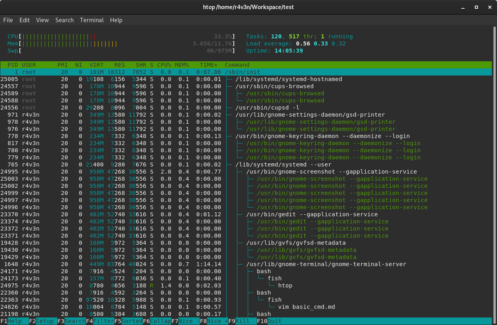
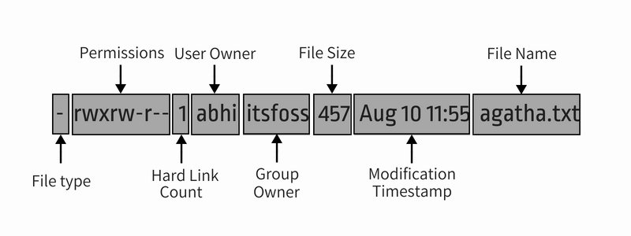

# Linux 

## Absolute Path vs Relative Path in Linux/Unix
###  What is a path?

A path is a unique location to a file or a folder in a file system of an OS. A path to a file is a combination of / and alpha-numeric characters.
### What is an absolute path?

An absolute path is defined as the specifying the location of a file or directory from the root directory(/). In other words we can say absolute path is a complete path from start of actual filesystem from / directory.

###  Some examples of absolute path:
```bash
/var/ftp/pub
/etc/samba.smb.conf
/boot/grub/grub.conf
```
If you see all these paths started from / directory which is a root directory for every Linux/Unix machines.

###  What is the relative path?

Relative path is defined as path related to the present working directory(pwd). Suppose I am located in /var/log and I want to change directory to /var/log/kernel. I can use relative path concept to change directory to kernel

changing directory to /var/log/kernel by using relative path concept.
```bash
 $ pwd/var/logcd kernel
``` 
Note: If you observe there is no / before kernel which indicates itâs a relative directory to present working directory.

Changing directory to /var/log/kernel using absolute path concept.
```bash
 $ cd /var/log/kernel
``` 
Note: We can use an absolute path from any location where as if you want to use relative path we should be present in a directory where we are going to specify relative to that present working directory.
 

# Basic Linux Command

## help

###  Man: an interface to the on-line reference manuals 
```bash
 $ man ls
```

## Wildcard
### \* show all picture (multiple char)
```bash
 $ ls pic*  
```
### **?** show only picture between 50 and 59 (only one char)
```bash
 $ ls pic5?.jpg  
```
### [] show only if char in [p-P]
```bash
 $ ls [pP]ic*
```
## Files and directory

### ls: list directory contents
```bash
 $ ls
 $args =  -l -a -r -t -h --help
```

### Pwd: output the current working directory
```bash
 $ pwd
```
### Cd: Change directory
```bash
 $ cd    
```
back to previous folder
```bash
 $ cd -   
```

### Mkdir: Make directory
```bash
 $ mkdir test1 test2 test3
 $ mkdir -p lol/lol/lol     
```
-p to create parent directory if needed

### Rmdir: Remove directory
```bash
 $ rmdir filename
 $ rm -rf filename
```

Delete all of the files in the diectory including all subdirectories and tier contents
```bash
 $ rm -r \* .\*  
```

Remove all files with the .doc extension recursively in the current working directory.
```bash
 $ rm \*\*/\*.doc
```

### Mv: Move directory (can be used to rename a file)
```bash
 $  mv file /opt/movedfile
```

### Cp: Copy file or directory
```bash
 $ cp file /opt/newcopiedfile 
```

### Touch: change file timestamps but it can also create files   
```bash
 $ touch nomdefichier.md  
 $ touch pic{00..99}.jpeg # does not work
```
  
### Which: Searching the PATH for executable files matching the names of the arguments
```bash
 $ which ls
```
### File: file — determine file type
```bash
 $ file myfile
```
## file viewer

### More: file perusal filter for crt viewing
```bash
 $ more filename 
```
###  Less: opposite of more but Less is more ;)
```bash
 $ less filename
```
###  Cat: concatenate files and print on the standard output
```bash
 $ cat filename
```
### tail : output the last part of files

```bash
$ tail -n 5 Workspace/SysAdminTraining/LinuxSysAdminsDoc/Linux/basic_cmd.md 
- dhclient > get ip
- gnome networkmanager 
- wpa_supplicant > encryption @ wifi


```

#SD out
2> send error into error file
/> send the result into list file
```bash
 find / -name "sudo" 2> error > list
```

Args -n define the number of line needed 
## Users

### change user home directory

```bash
 $ usermod -d /newhome/username username
```
usermod is the command to edit an existing user.
-d (abbreviation for --home) will change the user's home directory.


### adduser, addgroup - add a user or group to the system

```bash
 $ sudo adduser steve
[sudo] password for r4v3n: 
Sorry, try again.
[sudo] password for r4v3n: 
Adding user `steve' ...
Adding new group `steve' (1002) ...
Adding new user `steve' (1002) with group `steve' ...
Creating home directory `/home/steve' ...
Copying files from `/etc/skel' ...
New password: 
Retype new password: 
passwd: password updated successfully
Changing the user information for steve
Enter the new value, or press ENTER for the default
	Full Name []: 
	Room Number []: 
	Work Phone []: 
	Home Phone []: 
	Other []: 
Is the information correct? [Y/n] y

```

### user skeleton: skeleton files used for new user configuration 
```bash
 $ ls /etc/skel/
 $ ls -a                                                                        0 (0.002s) < 05:21:24
./  ../  .bash_logout  .bashrc  .profile

```

###  Change user
```bash
 $ su - marie
```

# Permissions

### Chmod: change file mode bits

A  combination of the letters **ugoa** controls which users' access to the file will be changed: 
- the user who owns it (u), 
- other users in the file's group (g), 
- other users not in the file's group  (o),
- or  all  users  (a).  

If none of these are given, the effect is as if (a) were given, but bits that are set in the umask are not affected.



```bash
marie@d3bi4n:~$ ls -l
total 4
-rw-r--r-- 1 marie marie 12 Apr  7 05:44 test


> $ chmod o-r mysecret

> -rw-r--**-**-- 1 marie marie 12 Apr  7 05:44 test

> $ chmod o+**rw** myscret 

> -rw-r--**rw**- 1 marie marie 12 Apr  7 05:44 test

```

## Using chmod in absolute mode

In the absolute mode, permissions are represented in numeric form (octal system to be precise). In this system, each file permission is represented by a number.

- r (read) = 4
- w (write) = 2
- x (execute) = 1
- – (no permission) = 0

With these numeric values, you can combine them and thus one number can be used to represent the entire permission set.

| Number | Permission |
|--------|------------|
| 0 | — |
| 1 | –x |
| 2  | -w- |
| 3 (i.e. 2+1) | -wx |
| 4 | r– |
| 5 (i.e. 4+1) | r-x |
| 6 (i.e. 4+2) | rw- |
| 7 (i.e. 4+2+1) | rwx |

### most commonly used: 755 644 600 640

Can you guess the file permission in numbers on agatha.txt file in our example so far? That’s right, it’s 764.

Now that you know what number represents which permission, let’s see how to change file permission using this knowledge.

Suppose you want to change the file permission on agatha.txt so that everyone can read and write but no one can execute it? In that case, you can use the chmod command like this:
```bash
 $ chmod 666 agatha.txt
```
## Danger :  if a folder has not the X (executable) right => you cannot open it.
  
-R for recursive on folder 

If you list agatha.txt now, you’ll see that the permission has been changed.
```bash
> -rw-rw-rw- 1 abhishek abhishek 457 Aug 10 11:55 agatha.txt 
```

### Chown: change file owner and group
```bash
 $ sudo chown marie:marie agatha.txt  

 -rw-rw-rw- 1 marie marie 457 Aug 10 11:56 agatha.txt 
```

### Groups: print the groups a user is in
```bash
 $ groups
```

Adds user marie into steve group
```bash
 $ sudo adduser marie steve
Adding user marie to group steve ...
Adding user marie to group steve
Done.

marie@d3bi4n:~$ groups
marie steve
```

## Sysadmin tools 

### ZFS
[zfs](https://www.howtogeek.com/175159/an-introduction-to-the-z-file-system-zfs-for-linux/)

### OpenDNS

[openDNS](https://signup.opendns.com/homefree/)

### Who:
```bash
student@debianserver:/var/log$ who
waldek   tty1         2021-04-08 11:06
student  pts/0        2021-04-08 11:13 (172.30.6.87)
student  pts/1        2021-04-08 11:14 (172.30.6.90)
student  pts/2        2021-04-08 11:14 (172.30.6.98)
student  pts/3        2021-04-08 11:21 (172.30.6.97)
student  pts/4        2021-04-08 11:15 (172.30.6.83)
student  pts/5        2021-04-08 11:15 (172.30.6.96)
student  pts/6        2021-04-08 11:23 (172.30.6.92)
student  pts/8        2021-04-08 11:15 (172.30.6.82)
student  pts/9        2021-04-08 11:17 (172.30.6.84)
student  pts/10       2021-04-08 11:16 (172.30.6.85)
student  pts/11       2021-04-08 11:17 (172.30.6.86)
student  tty2         2021-04-08 11:24

```
pts pseudo terminal remote
tty1 user loger localy on the machine

### Wall: write a message to all users
```bash
student@debianserver:/var/log$ wall 110101101101010
                                                                               
Broadcast message from student@debianserver (pts/10) (Thu Apr  8 11:29:42 2021)
                                                                               
110101101101010
                    
```

### & vs &&
```bash
 $ apt update && upgrade
# && launch both instance one after the other
 $ sleep 10 & htop
& launch in background the sleep 10 process and open htop
```
### exit status
```bash
 $ ls thisnotexist
ls: cannot access 'thisnotexist': No such file or directory
 $ echo $?
2
 $ ls
Desktop  Documents  Downloads  Music  Pictures  Public  Templates  Videos  Workspace
 $ echo $?
0
r4v3n@d3bi4n:~$ 

```
### Display Environement variables
```bash
 $ env
SHELL=/bin/bash
XDG_CURRENT_DESKTOP=GNOME
...
```
### Get users password hases:
```bash
 $ cat /etc/shadow | grep bash
 # get hashes
 $ sudo cat /etc/shadow | cut -d ":" -f2
 # get name
 $ sudo cat /etc/shadow | cut -d ":" -f1
```
### How to create a symbolic link in Linux
To create a symbolic link to target file from link name, 
you can use the ln command with -s option like this:

```bash
 $ ln -s target_file link_name
```

### alias:
```bash
 $ alias ll="ls -l"
```

The -s option is important here. It determines that the link is soft link. If you don’t use it, it will create a hard link. I’ll explain the difference between soft links and hard links in a different article.

### Htop: Interactive processes viewer
```bash
 $ htop
```
### Changer default shell
```bash
 $ vim /etc/passwd

steve:x:1002:1002:,,,:/home/steve:/bin/bash
steve:x:1002:1002:,,,:/home/steve:/bin/fish

```

## how to navigate in a web page source code 
### Pipe | : pipe send result of the first command to the second
```bash
 $ cat /etc/passwd **|** **grep** bash |**cut** -d ":" -f1 
```
### Grep: print lines that match patterns

Search for specific text with grep command
```bash
 $ grep -l example document1.txt document2.txt   
 $ grep -l example \*.txt
```
grep as long as you include the -r (recursive) option in the command.
```bash
 $ grep -lr example /path/to/directory1/\*.txt /path/to/directory2
```
Or, to search the current directory and all subdirectories, omit the path at the end of the command.
```bash
 $ grep -lr example
```

### Cut: remove sections from each line of files
```bash
> $ 
```
###  Wc: print newline, word, and byte counts for each file
```bash
 $ wc -l
```

### Realpath

```bash
$ realpath example.txt
/home/username/example.txt
```

### Wget: The non-interactive network downloader

```bash
 $ wget www.tandemlaw.be 
```
search url inside index.html
[Bashoneliners.com](bashoneliners.com)
  
```bash
$ cat index.html | grep -o "https.*" |cut -d "\"" -f1 |sort | uniq
```

## text editor
### Nano: Nano's ANOther editor, an enhanced free Pico clone
(simple text editor for noobies) 

```bash
 $ nano 
 $ nano filename
```
### VIM: vim - Vi IMproved, a programmer's text editor (PGM)
``` bash
 $ vim
 $ vim filename   
```
# APT
```bash
  $ apt install
  $ apt remove
  $ apt autoremove
  $ apt update
  $ apt search
  $ apt-cache search
```

## Display & Destop Manager

### Architecture:
```bash
 BIOS -> GRUB -> Display Manager -> Desktop Environement
```
###  Install Desktop Environement (GUI)
```bash
 $ tasksel
 $ apt install gnome
 $ apt remove gnome
```

### Reconfigurer le display manager
```bash
 $ sudo dpkg-reconfigure gdm3
```

### Installer le display manager
 
```bash
 $ sudo apt install lightdm

 $ sudo apt install gdm3
```
### remove Desktop environement
```bash


