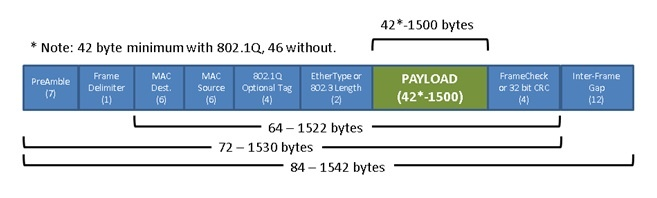
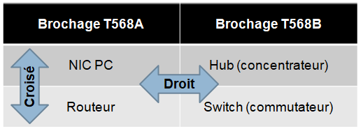
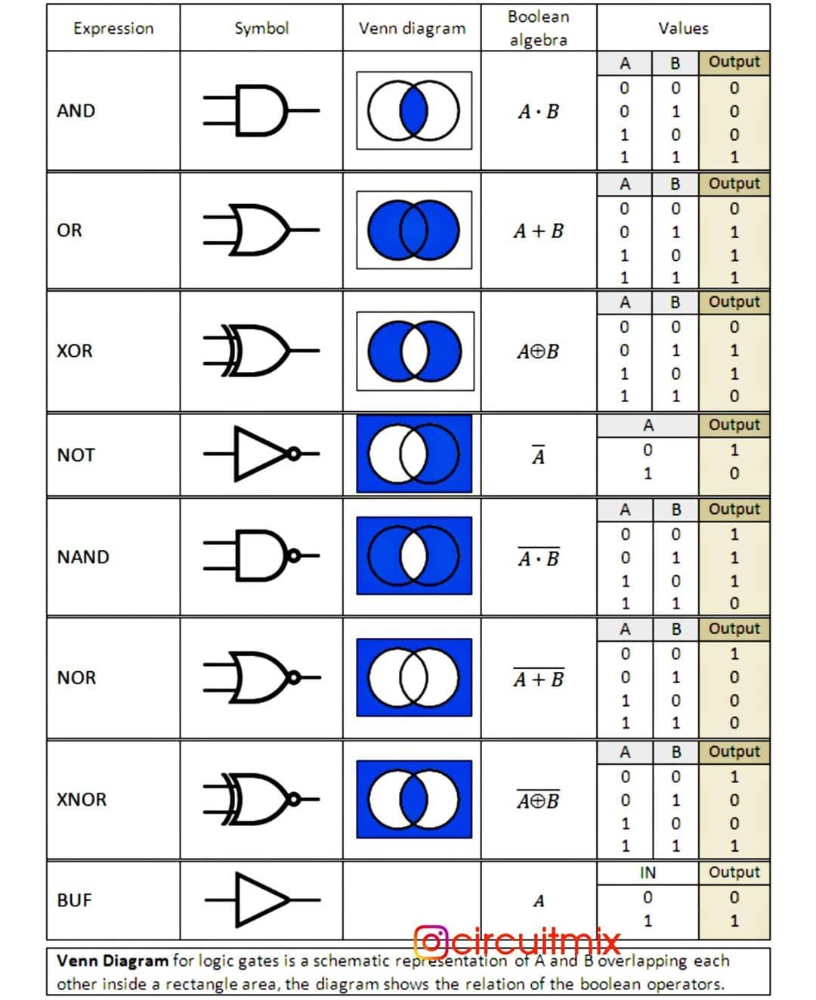
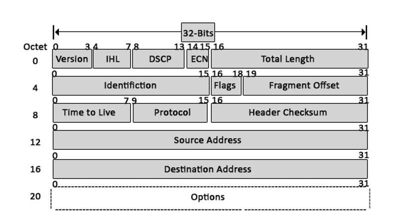
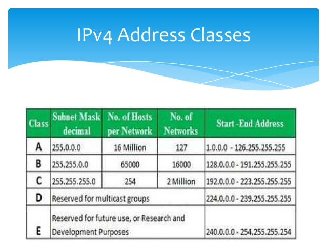
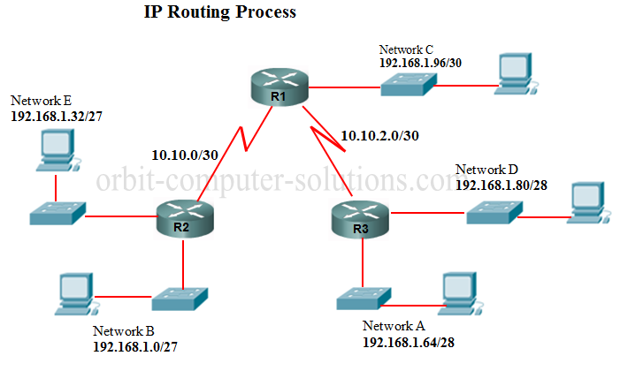
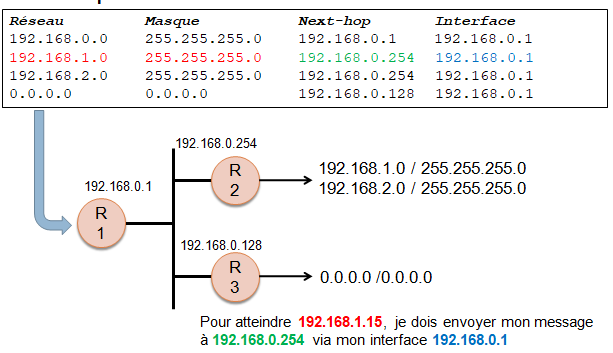
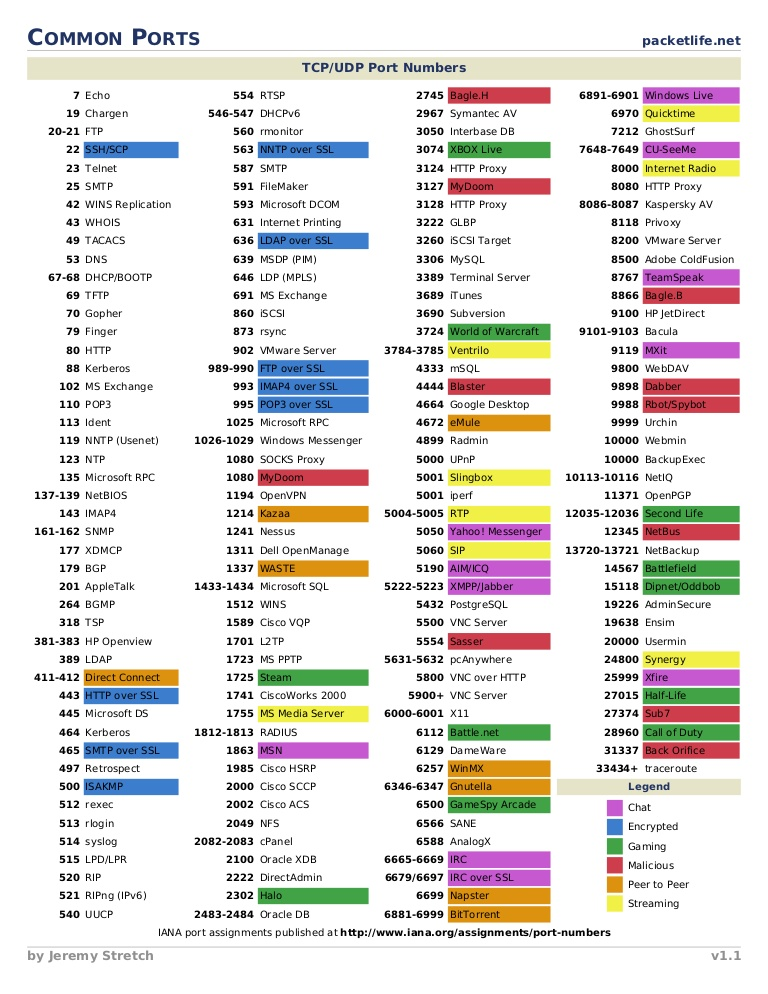
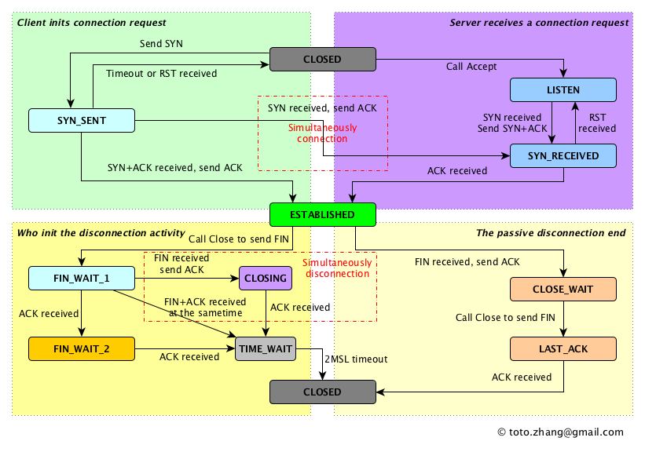

# Network

## components

- Switch
- Interconnexion du LAN
- Routeur
- Communication au-delà du LAN
- Frontière du LAN
- Point d’accès Wifi
- Extension du réseau filaire
- PC, Serveurs

## Architecture en couches définies et délimitées avec des notions de services et d’interfaces.

- **Service**: Ensemble de fonctionnalités, de commandes, d’événements, … ( ex: demande de connexion, réception de données, …)
- **Protocole**: Ensemble de règles et messages qui définissent un service.
- **Interface**: Moyen concret d’utiliser un service.

## Avantages des modèles en couches:

- Moins complexe (permet de décomposer les processus)
- Standardisation (il suffit de définir les « liaisons » entre les couches)
- Plus clair (la subdivision des fonctions permet de mieux décrire chaque étape)
- Facilité de développement
- Compatibilité entre fabricants (exigences définies par des normes)
- Ingénierie modulaire (chaque niveau peut être développé indépendamment)

# Modele TCP/IP

| | |
|-----|-----|
| Application | http, pop3, smtp, ftp |
| Transport | TCP, UDP (port number)|
| Internet | IPv4, IPv6, AppleTalk, DecNet |
| Network Access | Ethernet, Frame-Relay (Mac adresse) |

## Application layer

- Définit les services dont ont besoin les applications (ex: transfert de fichier).
- Fournit une interface entre l’application et le réseau.

## Transport Layer

Définit une série de services pour la couche « Application »:
- **Multiplexage**: Fonction qui permet au destinataire de choisir l’application appropriée aux données reçues en fonction du numéro de port.
- **Correction d’erreur**: Principe de numérotation et d’acquittement des données.
- **Contrôle de flux**: Permet d’éviter la surcharge des espaces tampons et des équipements de routage.
- **Etc**.

## Internet Layer

Définit un adressage logique ainsi qu’un processus de routage permettant de créer une infrastructure pour pouvoir échanger des données entre tous les ordinateurs d’un réseau.

## Network Layer

Définit les protocoles et le matériel requis pour acheminer des données sur un réseau physique.
- Câblage
- Adressage physique (adresse MAC pour Ethernet)
- Connecteurs
- Niveau de tension électrique
- Etc.

## Encapsulation

Processus qui consiste à placer des en-têtes et en-queues autour des données.

- Segment -> Transport Layer
- Paquet -> Internet Layer
- Frame (Trame) -> Network layer

# OSI Model

Dans le modèle OSI, pour désigner les bits qui forment l’entête ou l’en-queue d’une couche donnée ainsi que les bits de données inclus, on parle de PDU de couche X.
Parler de « paquet » revient à parler d’un PDU de couche 3.

|||||
|---|---|---|---|
|7|Application|Interface entre le logiciel de com. et l’application| APP
|6|Presentation|Définition du format des données (ascii, bin, jpeg …)| APP
|5|Session|Initier, contrôler et terminer des « conversations »| APP
|4|Transport|Contrôle de flux, correction d’erreur, multiplexage…| OS
|3|Network|Adr. logique, routage et détermination des routes| OS
|2|Data link|Accès au support, FCS, …| NIC |
|1|Physical|Spécifications physiques du support | NIC |

# Principe de communication

## Commutation de circuits

Etablir une liaison physiques permanente entre deux machines.
La liaison appartient aux machines qui l’utilisent.
Le circuit doit être établi avant que les informations puissent transiter.
Exemple: PSTN, ISDN

## Commutation de paquets

Les données sont découpées en paquets.
Chaque paquet transite indépendamment.
Permet de partager un même réseau en différents circuits virtuels.
Ex: X25, Frame-Relay

- Unicast
- Multicast
- Braodcast

# Access methods

## Accès aléatoire

- Transmission des données sans se préoccuper de l’état du réseau.
- Acquittement des données reçues.
- Les données perdues suite à une collision (signaux superposés, donc indéchiffrables) sont retransmises plus tard.

## Listening Before Talking

- Méthode CSMA (Carrier Sense Multiple Access).
- Ecouter le medium afin de vérifier si il est libre.
- Si le medium est libre, on peut émettre.
- Si le medium est occupé, on postpose l’émission.

- CSMA/CD (Ethernet): Détection des collisions et réaction.  
- CSMA/CA (WiFi): Eviter de produire des collisions

## Méthode à jeton

- Méthode déterministe
- Une machine ne peut émettre que lorsqu’elle a le jeton
- Le jeton ne reste qu’en temps défini en possession de la machine.
- Une machine peut calculer avec précision à quel moment elle peut émettre.

## Token-ring

- Anneau physique auquel est reliée chaque station du réseau.
- Chaque station possède deux circuits, un pour l’émission et un pour la réception. 
- Un jeton libre parcourt l’anneau dès qu’une station est mise en route. 
- Le parcours est unidirectionnel.

## FDDI

- Fiber Distributed Data Interface est un type de réseau informatique permettant d'interconnecter plusieurs LAN sur de la fibre.
- La technologie LAN FDDI est une technologie d'accès au réseau sur des lignes de type fibre optique.
- FDDI est un protocole utilisant un anneau à jeton à détection et correction d'erreurs.

# Topologie Reseau

## Topologie en bus

Les machines sont « chaînées » les unes aux autres. On utilise un câble unique. Pour éviter les phénomènes de réflexion, on place aux extrémités du bus des « bouchons » pour absorber le signal.

- Avantage :
Moins de câble que dans les autres topologies.
 
- Inconvénient :
Moins pratique à mettre en place que l’étoile.
Si le bus est corrompu, le réseau devient inopérant.

## Topologie en anneau

Topologie en bus refermée sur elle-même. Le sens de parcours du réseau est déterminé. 

- Avantage :
Le temps d’accès est déterminé ; une machine sait à quel moment elle va pouvoir « parler ».
Pas de collision
- Inconvénient :
Si l’anneau est corrompu, le réseau devient inopérant.

## Topologie en étoile

- Chaque machine est reliée au concentrateur de connexions.
- Forme la plus pratique et la plus fréquente dans les réseaux d’entreprises.

# Fonctionnement d’un LAN moderne

- LAN (Local Area Network)Fait référence aux normes des couches 1 et 2 (physique et liaison de donnée) conçues pour mettre en place un réseau de taille restreinte.
- WAN (Wide Area Network)Désigne un réseau qui assure la connectivité entre différents sites.
- IEEE (Institute of Electrical and Electronic Engineers)Organisation chargée de définir des normes, des standards, entre autre dans le domaine des réseaux informatique.

# Méthode d’accès CSMA/CD

## Algorithme CSMA/CD

Utilité:
Régit la manière dont une machine a accès au médium.
Permet de diminuer la probabilité qu’une collision se produise.
En cas de collision, agit afin d’y remédier.
Fonctionnement:
Un équipement qui veut émettre attend que le medium soit libre avant de commencer.
L’équipement écoute sur le medium pendant l’envoi pour détecter une éventuelle collision.
En cas de collision, l’équipement attend un laps de temps aléatoire avant d’émettre à nouveau.

taille d'une trame 64 bytes

# Protocole Ethernet

## Trame Ethernet

|Field|Function|Note|
|---|---|---|
|preamble|synchronisation| |
|SFD| begining of the frame| |
|destination|Adresse MAC de destination| |
|Source|Adresse MAC source| |
|Length/Type|Indique la longueur du champs de donnée OU le type.| si > 0x0600 => type (= 1536 decimal) |
|Data / Pad|Données et remplissage| |
|FCS | Vérification d’intégrité de la trame | |

## MAC adress

- Uniquement sur un réseau Ethernet ou WiFi !!!
- Adresse de niveau 2 (Liaison de données).
- Adresse inscrite en ROM sur une carte réseau.
- Unique pour chaque carte réseau.
- Codée sur 48 bits.
- Exprimée sous forme de 12 caractères hexadécimaux.

Ex: **00-24-BE**-BD-0C-0A
First part is the OUI: Organisationally Unique Identifier

Broadcast MAC = FF-FF-FF-FF-FF-FF

2439 = 
- 2 * 10³
- 4 * 10²
- 3 * 10¹
- 9 * 10 exp 0

## Equipements d’un LAN moderne

Permet, même sans connexion à un WAN:
Partage de fichiers
Partage d’imprimantes
Transfert de fichiers
Etc.

## Les répéteurs

- Relient plusieurs segments
- Interprètent les bits sous forme de 1 et 0.
- Génèrent un nouveau signal propre et fort.
- Permettent d’étendre un segment physique au-delà des limitations dues aux atténuations de signal

Equipement de la couche physique !!!

## Le HUB (Concentrateur)

- Typiquement un répéteur muni de plusieurs ports physiques

Equipement de la couche physique !!!

## Le Bridge (Pont)

- Dispositif matériel servant à relier deux segments utilisant le même protocole de niveau 2. (refereence couche OSI)
- Travaille au niveau de la couche liaison de données.
 Analyse les trames et agit en fonction des adresses MAC sources et destination qui y sont indiquées.
- Associe l’adresse MAC source de la trame au port par où elle arrive.
- Ne transmet pas une trame si les adresses MAC sources et destination sont situées du même côté du pont.
- Permet de réduire les risques de collisions.

Equipement de la couche liaison de donnée!!!

## Le Switch (Commutateur)

- Typiquement un pont multi-ports.
- Chaque port dispose d’une bande passante dédiée.
- Permet de supprimer le risque de collisions si un seul équipement est raccordé à chaque port du switch.
- Compare l’adresse MAC destination à la table d’adresse MAC et ne propage la trame que sur le port nécessaire si cette adresse est connue.
- Peuple la table d’adresse MAC en associant l’adresse MAC source des trames au port par lequel la trame entre.

Equipement de la couche liaison de donnée!!!

ex 1:
table d adresse mac
|num|MAC|PORT|
|---|---|---|
|2|11-11-11-11-11-11|Fa0/1|

1. analyse l integriter de la trame grace au FCS
2. check si il connait la source dans la table d'adresse MAC, Non
3. Envoi en broadcast pour etres sur que linformation arrive a destination

ex 2: 
table d adresse mac
|num|MAC|PORT|
|---|---|---|
|2|11-11-11-11-11-11|Fa0/1|
|2|11-11-11-11-11-22|Fa0/2|
|2|11-11-11-11-11-33|Fa0/3|
|2|11-11-11-11-11-44|Fa0/4|

!! l information la plus recent eeecrase les autres
!! table mac poising => fix port security
!! Port Flapping => sending frame with other mac adress

1. analyse l integriter de la trame grace au FCS
2. check si il connait la source est dans la table, Oui
3. envoi la trame sur le port de l adresse MAC de destination

### Avantages:

- Si un seul équipement est relié à chaque port du switch, il n’y a plus de collision.
- Les équipements connectés au switch ne partagent plus leur bande passante.
- Les trames ne sont envoyées que là où c’est nécessaire.

## FULL-Duplex

Envoyer et recevoir simultanément.
Possible quand:
Il n’y a pas de risque de collision (utilisation d’un switch, un seul équipement par port).
La NIC de l’équipement supporte le Full-Duplex

Double la bande passante !!!

## Câblage UTP Ethernet

Câblage utilisé par 3 normes:
- 10Base-T (Ethernet 10Mbits/s)
- 100Base-TX (Fast Ethernet 100Mbits/s)
- 1000Base-T (Gigabit Ethernet 1000Mbits/s)

UTP ( Unshielded Twisted Pair)
Câble composé de 2 ou 4 paires de fils en cuivre entourés de gaines plastiques souples, identifiés par un code couleur. Les extrémités sont munies de connecteurs RJ-45.
Les connecteurs RJ-45 s’insèrent dans les ports RJ-45.

# Un reseau se securise comme le modele OSI, layer par layer en commencant par la base. +Segregation des reseaux+.

## Câblage UTP Ethernet

La norme, élaborée par deux groupements industriels, la TIA et l’EIA, défini deux brochages.

**T568A (NIC PC, Routeurs)**

Le signal est envoyé par la paire n°3 et les signaux sont reçus sur la paire n°2.

**T568B (HUB, Switch)**

Les signaux sont reçus sur la paire n°3 et envoyés via la paire n°2.

## Types de câblage (U)TP

- UTP (Unshielded Twisted Pair) = U/UTPPaires torsadées non-blindées

- STP (Shielded Twisted Pair) = U/FTPChaque paire est blindée

- FTP (Foiled Twisted Pair) = F/UTPPaires torsadées écrantée (blindage général aluminium)

- SFTP (Shielded and Foiled Twisted Pair) = SF/UTPBlindage général + blindage par paire.

## Choix du câble

- Des équipements d’une même « famille » sont reliés entre eux par un câble croisé.
- Des équipements de « famille » différente sont reliés entre eux par un câble droit.

POE = Power over ethernet

# Logique binaire

145:  
256 0  
128 1 => 145 - 128 = 17  
64 0  
32 0   
16 1 => 17 - 16 =1  
8 0  
4 0  
2 0  
1 1  

10010001 = 145

Xor en pratique

AxorB=C
BxorC=A

archi 2 disk:
raid 0 = extention sur 2 disk , meilleur perfomeance car lis a deux endroit
raid 1 = 2 disk de type mirroire

archi 4 disk (combinaison des deux precedent)
raid 10 
raid 01

Raid 5 se base sur xor pour sauvgarder les donnee sur sur 3 volumes

volume 1 = A
volume 2 = B
volume 3 = AxorB (C)

si A fail, on peut recuperer et restaurer la data en faisant BxorC

# Couche Réseau

Fonctionnalités
- Adressage logique.
- Routage: acheminement des données.
- Détermination des routes.

Protocoles routables
- Définissent l’adressage logique et les informations nécessaires à l’acheminement des données.

Protocoles de routage
- Définissent les processus de partage des informations d’acheminement entre les routeurs.

Exemples de protocoles routables:
- IPv4
- IPv6
- AppleTalk (Apple)
- DECnet (Digital Equipment Corporation)
- Ipx (Novell)
Exemples de protocoles de routage:
- RIP
- EIGRP (Cisco)
- OSPF
- BGP

## Protocol IP

Mission: Acheminement de paquets de données entre leur source et leur destination.

Ce qu’il définit:
Un adressage logique identifiant chaque noeud du réseau.
Le routage des paquets. Les passerelles transmettent des données au réseau approprié.
Etc.

- IPv4:

**ToS (Type Of Service)**: marqueur servant à différencier la manière dont les paquets doivent être traités.
Identification, Flags Fragment Offset: indication concernant la fragmentation des paquets.
**TTL (Durée de vie)**: valeur définie par l’émetteur. Décrémenté à chaque saut. Si le TTL arrive à 0, le paquet est jeté.
**CRC (Somme de contrôle)**: permet de vérifier si l’entête est valide. Si elle a été corrompue, le paquet est jeté.

**Types d’adresses**
- Unicast: Adresse propre à une machine sur un réseau. L’envoi de données vers une adresse unicast permet d’acheminer les données vers une seule destination déterminée.
- Broadcast: Adresse propre à un réseau permettant de diffuser des données à toutes les machines de ce réseau.
- Multicast: Adressage permettant de diffuser des données depuis une source unique définie par l’adresse multicast vers un groupe de machines.

**Adresse IPv4**
- Codée sur 32 bits. Soit 4 octets.
- Composée d’un identifiant réseau et d’un identifiant hôte.

Ecriture décimale:  195.253.152.20
Valeur Binaire:        11000011.11111101.10011000.00010100
                       | identifian reseau       | identifiant hote

**Classes d’adresses**
- Les nombres de bits utilisés pour identifier le réseau et l’hôte varient en fonction de la classe.
- Trois classes principales: A, B et C, définies par la valeur des premiers bits de l’adresse.

**Classe A**

- 8 bits pour identifier le réseau, 24 bits pour identifier l’hôte.
- Le premier bit vaut 0.
- 0NNNNNNN.HHHHHHHHH.HHHHHHHH.HHHHHHHH  
- +- 16 Million adresses

**Classe B**
- 16 bits pour identifier le réseau, 16 bits pour identifier l’hôte.
- Les deux premiers bits vallent 10.
- 10NNNNNN.NNNNNNNN.HHHHHHHH.HHHHHHHH  
- 65236 adresses

**Classe C**  
- 24 bits pour identifier le réseau, 8 bits pour identifier l’hôte.
- Les trois premiers bits vallent 110.
- 110NNNNN.NNNNNNNN.NNNNNNNN.HHHHHHHH
- 256 adresses

**Classe D**
- Adresses Multicast
- De 224.0.0.0 à 239.255.255.255 
- 1110MMMM.MMMMMMMM.MMMMMMMM.MMMMMMMM

**Classe E**
- Classe réservée (non utilisée)
- De 240.0.0.0 à 254.255.255.254

**Exemples**:

- 81.135.78.179 est une adresse de classe A  
    Binaire:   01010001.10000111.01001110.10110011

- 140.125.0.10 est une adresse de classe B  
    Binaire:  10001100.01111101.00000000.00001010

- 193.190.147.65 est une adresse de classe C  
    Binaire:  11000001.10111110.10010011.01000001

**Adresse réseau**:

- S’obtient en remplaçant par 0 tous les bits de l’identifiant hôte de l’adresse.
- Deux machines peuvent communiquer sans intermédiaire uniquement si elles appartiennent au même réseau.

**Adresse broadcast (de diffusion)**:

- S’obtient en remplaçant par 1 tous les bits de l’identifiant hôte de l’adresse.
- Peut être utilisé pour communiquer avec l’ensemble des machines d’un même réseau.
- Dernière adresse du réseau (non assignable à un hôte).

**Masque réseau**:
- Codé sur 32 bits, soit 4 octets.
- Comprend des 1 pour les bits associés au réseau.
- Comprend des 0 pour les bits associés à l’hôte.
- Permet de déterminer l’adresse réseau pour une adresse IP donnée par l’application de la fonction logique ET (AND).

    193.190.147.65 est une adresse de classe C (24 bits réseau)  
    Adresse: 11000001.10111110.10010011.01000001  
    Masque:  11111111.11111111.11111111.00000000  

    Réseau:  11000001.10111110.10010011.00000000  
    Soit:       193  .   190  .   147  .   0  

**Définir le nombre d’adresses hôtes sur un réseau.**

Exemple: 198.65.30.0  
    Binaire: 11000110.01000001.00011110.0000000  
    Classe C, donc 24 bits pour le réseau et 8 bits pour les hôtes.
        - Nombre d’hôtes = 28 – 2 = 254

**Il faut déduire l’adresse réseau et l’adresse de broadcast !!!**

nb hotes : 2n-2 = 2 exp 16 -2 = 65534

[CIDR](https://docs.netgate.com/pfsense/en/latest/network/cidr.html)
- CIDR (Classless Inter-Domain Routing)
- Découpe de réseau en s’affranchissant des classes.
- Permet de réduire le gaspillage d’adresses non-utilisées.
- La taille du réseau est définie en fonction des besoins et non plus des classes.
- Masque réseau exprimé sous forme traditionnelle (4 octets) ou par notation CIDR (par exemple /20).

Exemple: 

    Un réseau doit supporter 100 hôtes.  
    Combien de bits sont nécessaires pour définir au moins 100 adresses ?  
    6 => 26-2 = 62 (pas assez)  
    7 => 27-2 = 126   
    8 => 28-2 = 254 (trop)  

    Rmq: l’adresse réseau et l’adresse de diffusion ne peuvent pas être attribuées à un hôte.

    On a donc 7 bits pour les hôtes ce qui laisse  25 bits (32-7) pour l’identifiant réseau.

    En notation CIDR:  /25
    En notation binaire: 11111111.11111111.11111111.10000000
    Soit: 255.255.255.128

Exemple: 

    Déduire l’adresse réseau d’une adresse IP et de son masque.  
    Prenons comme base l’adresse:  181.157.121.12 /22

    /22 signifie que l’on attribue 22 bits à l’identifiant réseau. Ce qui donne le masque: 11111111.11111111.11111100.00000000 soit 255.255.252.0

    Appliquons le masque à l’adresse:

    Adresse: 10110101.10011101.01111001.00001100
    Masque : 11111111.11111111.11111100.00000000
    ============================================
    Réseau : 10110101.10011101.01111000.00000000
    Soit   :    181  .   157  .   120  .    0

    Bcast  : 10110101.10011101.01111011.11111111
    Soit   :    181  .   157  .   123  .   255

# Routage

Définition: Processus consistant à choisir un chemin dans un réseau pour y envoyer du traffic en fonction de paramètres (source, destination, encombrement, ...).

**Concepts**  
- Le choix de l’itinéraire se fait sur chaque noeud.
- La route indique la machine à qui il faut envoyer le message pour atteindre le réseau souhaité. (next-hop)
- La route la plus précise sera toujours utilisée en priorité (celle dont le masque réseau est le plus grand).
- Si aucune route ne correspond à la destination, le message est détruit.

Définition:
    
    Table reprenant une liste de routes vers des réseaux de destination auxquelles est généralement associée une métrique.

Composants d’une route:

- Adresse réseau de destination
- Masque du réseau de destination
- Adresse du prochain « saut » (aussi appelé « next-hop », « passerelle » ou encore « noeud »).
- Interface de sortie (l’interface qui mène au prochain saut).

**Table de routage**:

**Pas de route, pas de packet :)**

# ARP

# La couche transport > Segment

Multiplexage => plusieur app communique sur le reseau avec la meme interface.

- **Multiplexage**: Fonction qui permet au destinataire de choisir l’application appropriée aux données reçues en fonction du numéro de port.
- **Correction d’erreur**: Principe de numérotation et d’acquittement des données. Retransmissions des données non acquittées.
- **Contrôle de flux**: Permet d’éviter la surcharge des espaces tampons et des équipements de routage.
- **Transfert de données séquentiel**: Permet au destinataire de recomposer les données segmentées lors de l’envoi.
- **Etablissement et terminaison des connexions**

**TCP (Transmission Control Protocol)**  
    Protocole « fiable ».
    Principe d’envoi et d’acquittement des données.
    Etablissement d’une connexion avant l’envoi des données.
    Contrôle de flux par fenêtrage.
    Correction d’erreur.

**UDP (User Datagram Protocol)**  
    Protocol peu fiable (pas d’acquittement). Mais plus « léger ».
    Pas de connexion avant l’envoi de données.
    Pas de fenêtrage, ni de correction d’erreur.

TCP - 3 way hand-shake  

- Processus en 3 étapes (3-ways hand-shake): synchroniser les SEQ.
- Crée une connexion entre deux sockets
- Envoi d’un signal dans l’entête TCP (SYN et/ou ACK)
- Un socket est composé de:
    Une adresse IP (comprise dans l’ent-ête IP).  
    Un protocole (TCP) défini par le type d’entête de niveau 4.  
    Un port (doit être indiqué dans l’entête de niveau 4).  

TCP – Transfert de données séquentiel

Les protocoles de niveau 3 ont chacun leur taille de données maximum qu’ils peuvent véhiculer dans un seul paquet (MTU), ex: 1500 octets pour l’Ethernet.
Pour envoyer des données de grande taille il faut les segmenter.
Le récepteur doit donc recomposer les données,  en assemblant les segments dans le bon ordre. Ce qui est possible grâce au numéro de séquence.

TCP – Transmissions de données
A envoi des données, B acquitte les dernières données reçues. Le n° d’acquittement correspond au dernier byte reçu.

ACK = SEQ + DATA 

TCP – Fenêtrage (Windowing)

Contrôle de flux par fenêtrage.
Fenêtre: Nombre maximum de bytes qui peuvent être envoyés sans acquittement.
La taille de la fenêtre varie dans le temps. Augmente progressivement jusqu’à l’apparition d’une erreur.
L’expéditeur envoi jusqu’à ce que la limite de la fenêtre soit atteinte. Le récepteur doit alors acquitter les données avant  que l’expéditeur ne puisse en renvoyer.

TCP – Correction d’erreur
A envoi des données, des données n’arrivent pas à destination. B acquitte la dernière séquence complète reçue. A retransmet la partie manquante. B acquitte la fin des données.

Terminaison d’une connexion

Processus en 4 étapes.

Applications et ports réservés

Principaux services TCP/IP

DHCP
